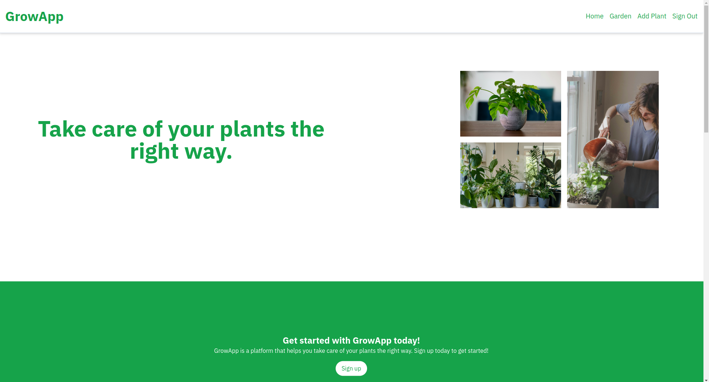
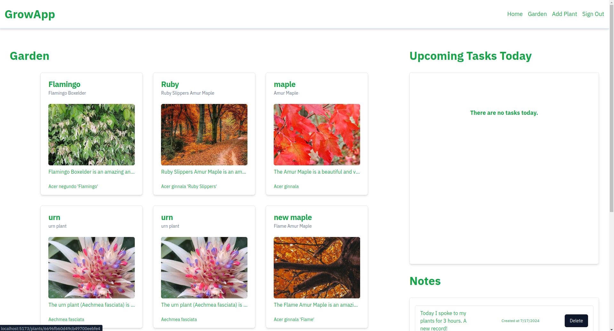
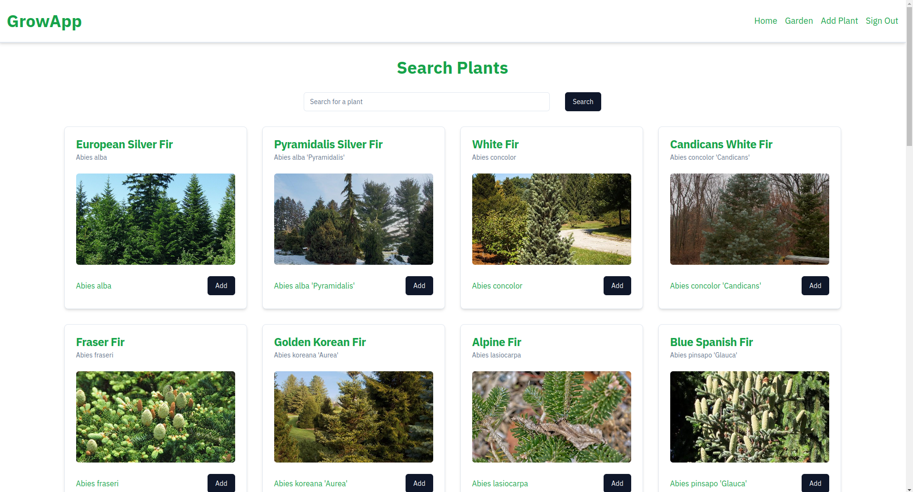

# growapp

This is an app you can use to track plants you have in your garden, and schedule tasks to complete at specified intervals.

### Screenshots

### Getting started

- The deployed website can be found [here](https://rundown-58b9d07143ca.herokuapp.com/runs).

* The planning materials for this project can be found [here](https://trello.com/b/UvdoJP1z/group-project-3).

### Attributions

- Some images were sourced from [Unsplash](https://unsplash.com/).

### Technologies Used

#### Languages

- HTML
- CSS
- JavaScript
- Node.js
- MongoDB

#### Libraries and Frameworks

- Express
- Mongoose
- React
- Framer Motion
- Shadcn

### Next Steps

Next for this project we would like to add the following features:

- Ability to add custom tasks
- Reminders for tasks
- Better task scheduling
- More detailed plant information
